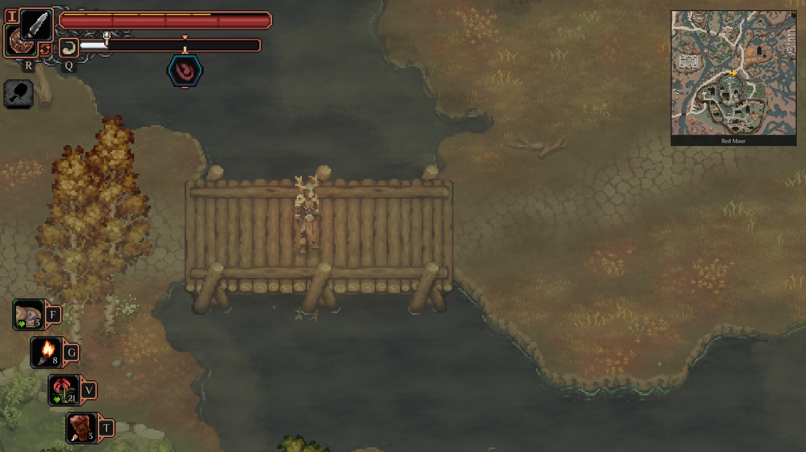

# Drova Minimap

A small, always-on minimap for **Drova - Forsaken Kin**. It uses the game's own
map art, keeps the player at the centre, and follows the same maps you have
unlocked in game.

[Download the latest release](https://github.com/doyaGu/DrovaMinimapMod/releases/latest)
· [Report an issue](https://github.com/doyaGu/DrovaMinimapMod/issues)



## What it does

- Shows the most relevant unlocked map for your current position.
- Keeps your direction arrow in the middle of the minimap.
- Shows Drova's native map and NPC markers when they enter the visible area.
- Switches to a detailed area map when you enter one, or can stay on the world
  map if you prefer.
- Hides with the game's HUD, menus, and modal windows.
- Works with every language directory shipped by Drova.

The mod does not open the original map, change its selected tab, reveal maps
you have not unlocked, or add an enemy radar.

## Installation

1. Install [MelonLoader](https://melonwiki.xyz) for Drova.
2. Install [Drova Modding API](https://github.com/Drova-Modding/Drova-Modding-API)
   into Drova's `Mods` directory.
3. Download the `DrovaMinimapMod-<version>.zip` asset from the
   [latest release](https://github.com/doyaGu/DrovaMinimapMod/releases/latest).
4. Extract `DrovaMinimapMod.dll` from the ZIP into Drova's `Mods` directory.
5. Start the game. The minimap is enabled by default.

Your `Mods` directory should contain both DLLs:

```text
Drova/
└── Mods/
    ├── Drova_Modding_API.dll
    └── DrovaMinimapMod.dll
```

## Settings

Open Drova's shared **Modding** settings page to change the minimap:

- **Enable minimap** — show or hide it.
- **Switch to area maps** — use the smallest matching local map when one is
  available. Turn this off to keep the matching world map instead.
- **Size**, **Zoom**, and **Opacity** — adjust the on-screen presentation.

Settings are saved with the game's gameplay configuration. There is no minimap
hotkey, so Drova's `M` key remains reserved for the original map.

## Notes

The minimap appears only when Drova has an enabled map for the active scene and
your current position. Areas without a usable map stay hidden. If Drova's
original map artwork has not loaded yet, the mod temporarily uses a simple
radar background and automatically adopts the native artwork when it becomes
available.

## For contributors

The current release is tested with Drova Modding API `0.5.2`. Build without
deploying to the game:

```powershell
dotnet build .\DrovaMinimapMod.csproj -c Release
```

Create a release ZIP with:

```powershell
.\scripts\Build-Release.ps1 -GameRoot 'C:\Games\Drova'
```

See [TESTING.md](TESTING.md) for the manual release checklist and
[CHANGELOG.md](CHANGELOG.md) for release history.

## License

Released under the [MIT License](LICENSE).
